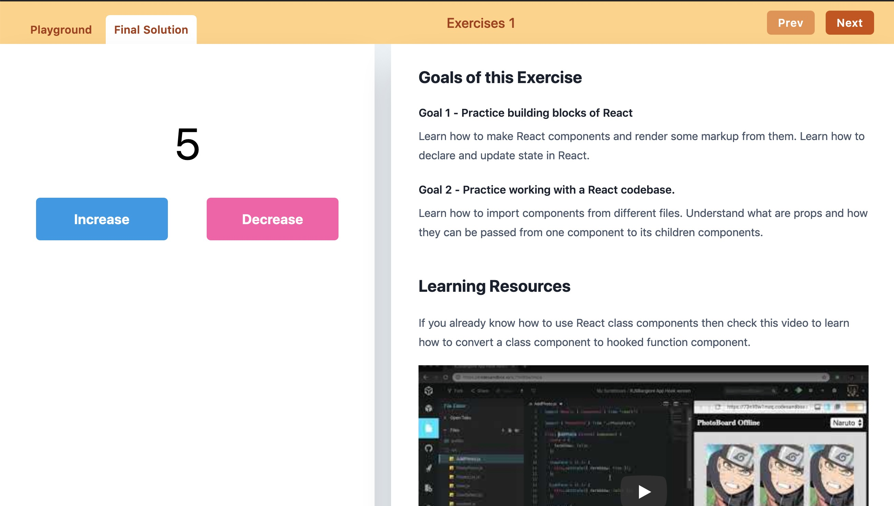

# Workshop Platform
People understand new things when they "learn by doing". Its time our courses and **workshops** start reflecting that. Make exercises where you ask learners to build something. Then add helpful notes and your version so they try first and see what they missed.



## Quick Start

Fork and clone this repo and then do the following-

1. Install dependencies-

```sh
yarn install
```

2. Start frontend & server in **separate terminals**.

```sh
# Tab 1
yarn dev

# Tab 2
yarn server
```

Open the project on `http://localhost:3000/exercises/exercise-1`.

### For learners

If you want to solve Exercise 1 then open `src/pages/exercises/exercise-1/playground.js`. When you edit the component it should update in the browser in real time.

In the browser you can see the notes on the right-hand side. You can see the tutor's solution by switching tabs. Their code will be present in the `challenge.js` alongside your file.

### For Tutors

Exercise lives in folder `src/pages/exercises/exercise-1`. For each exercise you need to add notes in `notes.mdx` and the challenge in `challenge.js`.

**Create new exercise with**

```sh
yarn create-exercise
```

**Create evaluator tests**

You can also add an evaluator for each exercise like we do in `src/exercise-tests` folder. Run it with `yarn test-exercises`.

**Use JSON APIs**

Many challenges go along the lines of - fetch list of blog posts from an API, show the data in UI. For that there is a ready-made API server with various collections. Run it with `yarn server`.

Under the hood it uses `json-server` package so you can GET requests with pagination, filter support and also make mutations like POST request which would keep the side-effects in memory till the server is running.

[Documentation on API parameters](https://github.com/typicode/json-server#routes).
